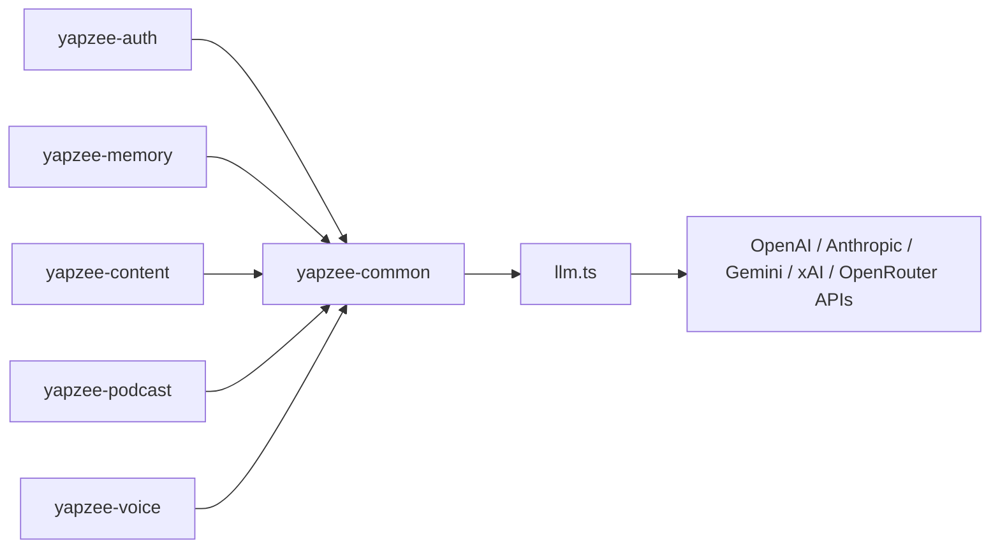

# yapzee-common

The shared TypeScript library for YapZee services, running on **Bun**: one
place for the code every service needs — LLM (large language model)
provider routing, environment config, JWT (JSON Web Token) helpers, internal
service-to-service auth, and the lesson-transcript parser.

This is a straight TypeScript port of the original Python library (see
`yapzee-docs/docs/SD-06-typescript-bun-migration.md`). Services on the new
Bun stack install it as a git dependency; there is no npm-registry publish
step. Python consumers of the old library are unaffected — they pin this
repo by commit SHA in their own lockfiles and stay on their pre-migration
commit.

## Where it sits



**New here? Read [`docs/HOW-IT-WORKS.md`](docs/HOW-IT-WORKS.md) top to bottom (5 min).**

## Quickstart (as a consumer)

1. In your service's `package.json`, add a git dependency:
   ```json
   "yapzee-common": "github:pisithrps/yapzee-common"
   ```
2. `bun install`
3. `import { streamLlm } from "yapzee-common";`

## Modules

| Module | Exports | Purpose |
|---|---|---|
| `src/config.ts` | `settings`, `MODELS`, `ModelInfo` | env-based API keys + the shared model menu (lazy — reads `process.env` at access time) |
| `src/llm.ts` | `streamLlm(prompt, modelInfo)` | one async-generator streaming entry point for OpenAI / Anthropic / Gemini / xAI / OpenRouter |
| `src/auth.ts` | `createToken`, `decodeToken`, `requireJwtSecret` | HS256 JWT mint/verify (via `jose`) shared by all services |
| `src/internalAuth.ts` | `requireInternalKey`, `checkInternalKey` | Hono middleware (+ pure fn) gating service-to-service endpoints behind the `X-Internal-Key` header (`INTERNAL_API_KEY` env) |
| `src/lessonParser.ts` | `parseToSegments`, `parseExpectedAnswers`, `estimateTimestamps`, `calculatePauseDuration`, `stripToSpokenScript`, `CHARS_PER_SECOND`, `ES_TAG_RE`, `ELLIPSIS_RE`, `cleanSpokenText`, `findAnswerText`, `isSkippable`, `normalizePauses` | parse lesson markdown into speak/pause segments, timestamps, and pause durations |

## Environment variables

| Variable | Required? | Purpose |
|---|---|---|
| `OPENAI_API_KEY` | If using `provider: "openai"` | OpenAI API auth |
| `ANTHROPIC_API_KEY` | If using `provider: "anthropic"` | Anthropic API auth |
| `GOOGLE_API_KEY` | If using `provider: "gemini"` | Gemini API auth |
| `XAI_API_KEY` | If using `provider: "xai"` | xAI (Grok) API auth |
| `OPENROUTER_API_KEY` | If using `provider: "openrouter"` | OpenRouter API auth |
| `AZURE_SPEECH_KEY` | If your service does TTS (text-to-speech) | Azure Speech auth |
| `AZURE_SPEECH_REGION` | If your service does TTS | Azure Speech region |
| `YAPZEE_JWT_SECRET` | Only if you call an `auth` function | HS256 signing secret for JWTs |
| `YAPZEE_JWT_TTL_DAYS` | No (default `30`) | JWT expiry window in days |
| `INTERNAL_API_KEY` | Only if you call `internalAuth.requireInternalKey` | shared secret checked against the `X-Internal-Key` header |

## Developing

`bun install && bun test` — runs the full suite. `bun run typecheck` runs
`tsc --noEmit`. To ship a change to consumers: commit, push, then in each
consumer run `bun update yapzee-common`.
