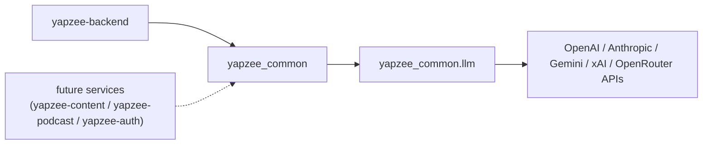

# yapzee-common

The shared Python library for YapZee services: one place for the code every
service needs — LLM (large language model) provider routing, environment
config, JWT (JSON Web Token) helpers, and the lesson-transcript parser.
Services install it straight from GitHub as a `uv` git dependency; there is
no PyPI publish step.

## Where it sits



Today the monorepo backend (`yapzee/backend`) is the only consumer. It
replaced its local `app/config.py`, `app/llm.py`, and `app/lesson_parser.py`
with this package.

**New here? Read [`docs/HOW-IT-WORKS.md`](docs/HOW-IT-WORKS.md) top to bottom (5 min).**

## Quickstart (as a consumer)

1. In your service's `pyproject.toml`, add `"yapzee-common"` to
   `dependencies` and point `[tool.uv.sources]` at the git repo:
   ```toml
   [tool.uv.sources]
   yapzee-common = { git = "https://github.com/pisithrps/yapzee-common.git" }
   ```
2. `uv lock && uv sync`
3. `from yapzee_common.llm import stream_llm`

## Modules

| Module | Exports | Purpose |
|---|---|---|
| `yapzee_common.config` | `settings`, `MODELS`, `JWT_ALGORITHM`, `JWT_SECRET`, `JWT_TTL_DAYS` | env-based API keys + the shared model menu |
| `yapzee_common.llm` | `stream_llm(prompt, model_info)` | one streaming entry point for OpenAI / Anthropic / Gemini / xAI / OpenRouter |
| `yapzee_common.auth` | `create_token`, `decode_token`, `require_jwt_secret` | HS256 JWT mint/verify shared by all services |
| `yapzee_common.lesson_parser` | `parse_to_segments`, `parse_expected_answers`, `estimate_timestamps`, `calculate_pause_duration`, `strip_to_spoken_script` | parse lesson markdown into speak/pause segments, timestamps, and pause durations |

## Environment variables

| Variable | Required? | Purpose |
|---|---|---|
| `OPENAI_API_KEY` | If using `provider: "openai"` | OpenAI API auth |
| `ANTHROPIC_API_KEY` | If using `provider: "anthropic"` | Anthropic API auth |
| `GOOGLE_API_KEY` | If using `provider: "gemini"` | Gemini API auth |
| `XAI_API_KEY` | If using `provider: "xai"` | xAI (Grok) API auth |
| `OPENROUTER_API_KEY` | If using `provider: "openrouter"` | OpenRouter API auth |
| `AZURE_SPEECH_KEY` | If your service does TTS (text-to-speech) | Azure Speech auth |
| `AZURE_SPEECH_REGION` | If your service does TTS | Azure Speech region |
| `YAPZEE_JWT_SECRET` | Only if you call an `auth` function | HS256 signing secret for JWTs |
| `YAPZEE_JWT_TTL_DAYS` | No (default `30`) | JWT expiry window in days |

## Developing

`uv run --group dev pytest -q` — 8 tests. To ship a change to consumers:
commit, push, then in each consumer run
`uv lock --upgrade-package yapzee-common && uv sync`.
